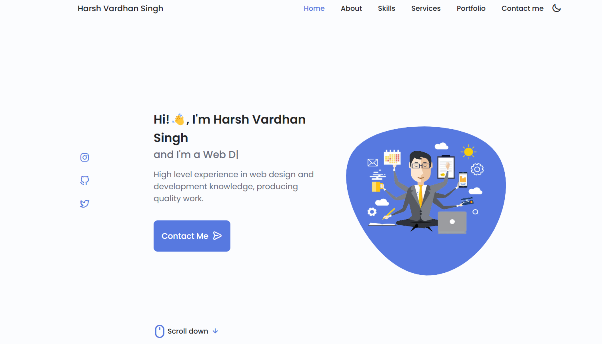
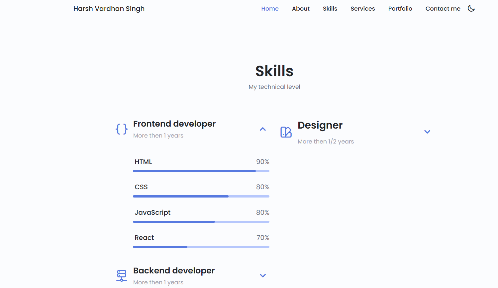

# portfolio1
Welcome to my portfolio! This project showcases my work and skills in web development using HTML, CSS, and JavaScript.

## Introduction

This portfolio demonstrates my abilities in creating responsive and interactive web pages. It includes various sections that highlight my projects, skills, and contact information.

## Features

- **Responsive Design**: The portfolio is designed to look great on devices of all sizes.
- **Interactive Elements**: Includes interactive features such as animations and transitions.
- **Project Showcase**: A section dedicated to showcasing my previous work and projects.
- **Contact Form**: A form to get in touch with me directly.

## Technologies Used

- **HTML**: For structuring the content.
- **CSS**: For styling and layout.
- **JavaScript**: For interactive elements and functionality.

## some photos

-
-

